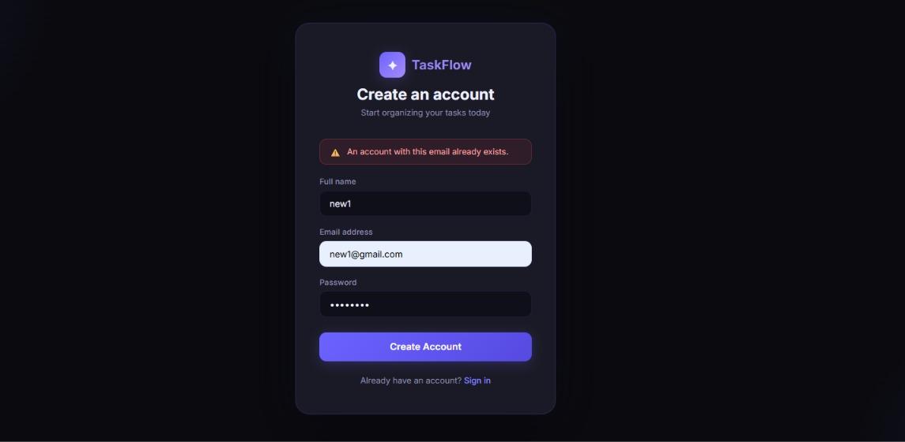
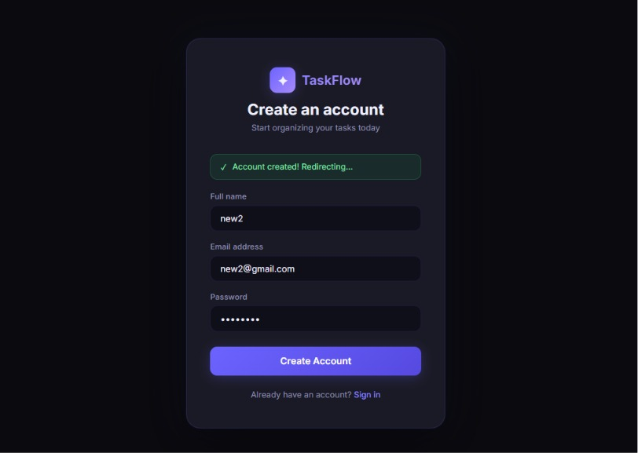
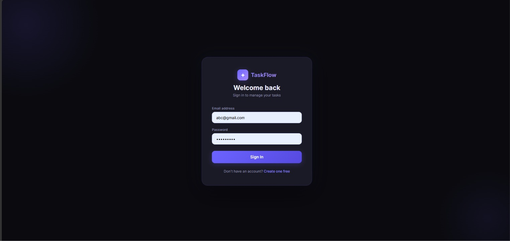
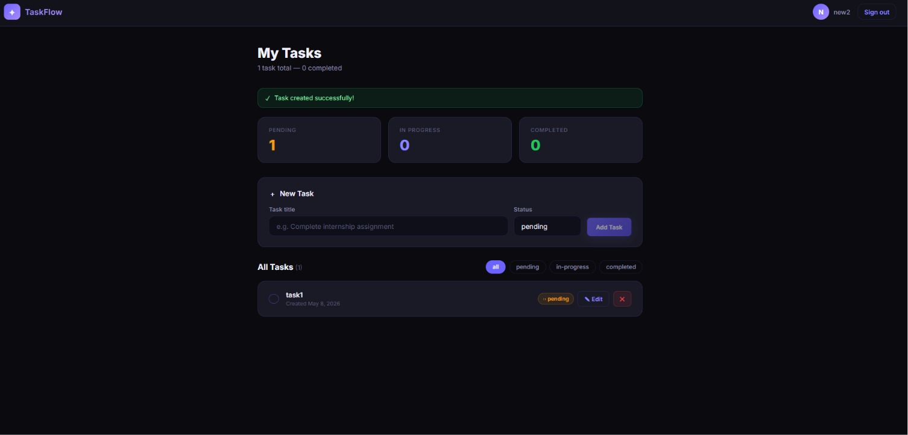
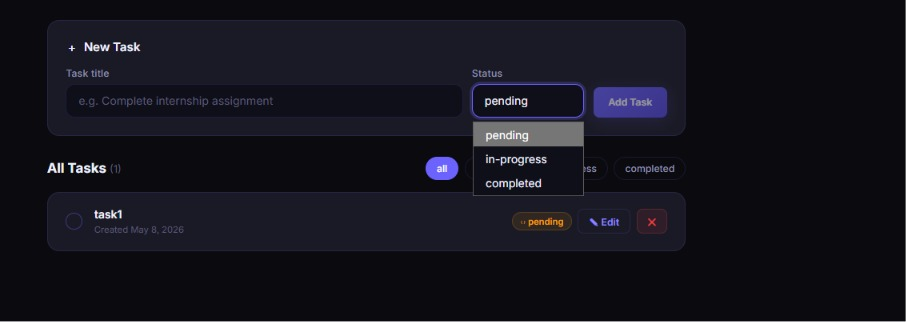
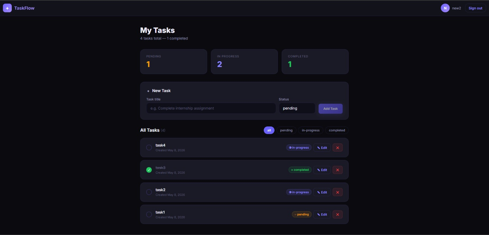
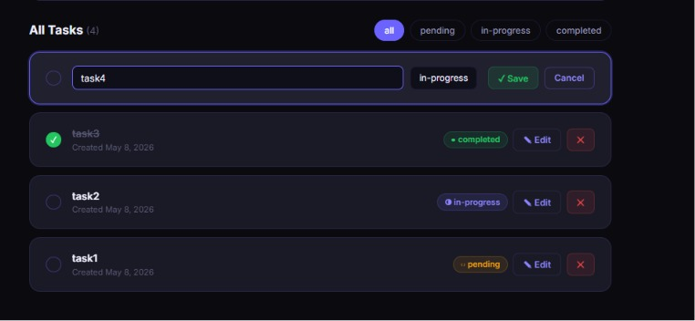
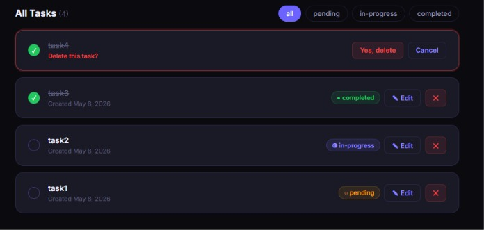
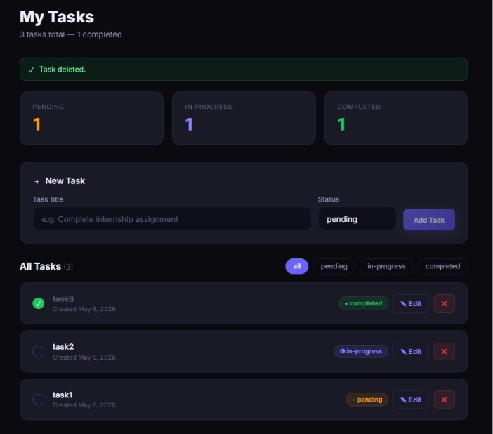

# TaskFlow — Task Management REST API

A **production-grade** RESTful API built with **Node.js**, **Express.js**, and **MongoDB**.

Features JWT authentication, bcrypt password hashing, role-based access control (RBAC), Swagger interactive docs, rate limiting, and request logging.

**Frontend:** React + Vite SPA in `/frontend` with full CRUD UI.

---

## 🎬 Demo

### 📹 Project Walkthrough Video

https://github.com/DhanujaAnbalagan/secure-task-management-system-/blob/main/assets/screenshots/video1.mp4

> ▶️ Click the video above to watch the full project walkthrough — covers registration, login, task CRUD, admin panel, and Swagger docs.

---

### 📸 Screenshots

| Sign In Page | Sign In (Alt) |
|:---:|:---:|
|  |  |

| Login Page | Central / Dashboard |
|:---:|:---:|
|  |  |

| Task View 1 | Task View 2 |
|:---:|:---:|
|  |  |

| Task View 3 | Task View 4 |
|:---:|:---:|
|  |  |

| Admin / Stats Panel |
|:---:|
|  |

---

## Tech Stack

| Layer           | Technology                          |
|-----------------|-------------------------------------|
| Runtime         | Node.js ≥ 18                        |
| Framework       | Express.js 4.x                      |
| Database        | MongoDB + Mongoose 8.x              |
| Authentication  | JSON Web Tokens (jsonwebtoken)      |
| Password Hashing| bcryptjs                            |
| Validation      | express-validator                   |
| API Docs        | Swagger UI (swagger-jsdoc)          |
| Rate Limiting   | express-rate-limit                  |
| Logging         | morgan                              |
| Frontend        | React 18 + Vite 5 + React Router 6 |

---

## Project Structure

```
task-management-api/
├── config/
│   ├── db.js                  # MongoDB connection with retry logic
│   └── swagger.js             # OpenAPI 3.0 spec definition
├── controllers/
│   ├── authController.js      # Register, Login, GetMe
│   ├── taskController.js      # Task CRUD with pagination
│   └── adminController.js     # Admin: all users + platform stats
├── middleware/
│   ├── auth.js                # JWT protect + authorize(role)
│   ├── errorHandler.js        # Global error handler (Mongoose, JWT, etc.)
│   ├── rateLimiter.js         # Auth limiter + general API limiter
│   └── validate.js            # express-validator result runner
├── models/
│   ├── User.js                # User schema (bcrypt pre-save hook)
│   └── Task.js                # Task schema
├── routes/
│   ├── authRoutes.js          # /api/v1/auth/* (with Swagger JSDoc)
│   ├── taskRoutes.js          # /api/v1/tasks/* (with Swagger JSDoc)
│   └── adminRoutes.js         # /api/v1/admin/* (with Swagger JSDoc)
├── utils/
│   ├── generateToken.js       # JWT signing helper
│   └── response.js            # Standardized sendSuccess / sendError
├── validators/
│   └── index.js               # All validation chains
├── frontend/                  # React + Vite frontend app
│   ├── src/
│   │   ├── api/axios.js       # Axios instance with JWT interceptor
│   │   ├── components/        # ProtectedRoute
│   │   └── pages/             # Login, Register, Dashboard
│   ├── package.json
│   └── vite.config.js
├── app.js                     # Express app factory (middleware, routes, Swagger)
├── server.js                  # Entry point + graceful shutdown
├── .env.example               # Environment variable template
└── package.json
```

---

## Getting Started

### Prerequisites

- **Node.js** ≥ 18 — [nodejs.org](https://nodejs.org)
- **MongoDB** running locally on port `27017` — [mongodb.com/try/download](https://www.mongodb.com/try/download/community)
  - Or use a free [MongoDB Atlas](https://www.mongodb.com/atlas) cloud URI

---

### 1. Clone the Repository

```bash
git clone https://github.com/DhanujaAnbalagan/secure-task-management-system-.git
cd secure-task-management-system-
```

---

### 2. Install Backend Dependencies

```bash
npm install
```

---

### 3. Configure Environment Variables

```bash
cp .env.example .env
```

Open `.env` and fill in your values:

```env
PORT=5000
NODE_ENV=development

MONGO_URI=mongodb://127.0.0.1:27017/taskmanager

JWT_SECRET=replace_this_with_a_long_random_secret
JWT_EXPIRES_IN=7d

BCRYPT_SALT_ROUNDS=12
```

> ⚠️ **Never commit your `.env` file.** It is already in `.gitignore`.

---

### 4. Start the Backend

```bash
# Development — auto-reloads on file changes
npm run dev

# Production
npm start
```

The API will be available at: **`http://localhost:5000`**

---

### 5. Install & Start the Frontend

```bash
cd frontend
npm install
npm run dev
```

The React app will be available at: **`http://localhost:3000`**

> The Vite dev server proxies all `/api` requests to the backend automatically.

---

## API Documentation (Swagger)

Once the backend is running, open:

```
http://localhost:5000/api-docs
```

- **Authorize** by clicking the 🔓 button and entering: `Bearer <your_token>`
- All endpoints are documented with request/response schemas
- Raw OpenAPI JSON: `http://localhost:5000/api-docs.json`

---

## API Reference

### Base URL: `http://localhost:5000/api/v1`

---

### Auth Endpoints

| Method | Endpoint           | Access  | Description                      |
|--------|--------------------|---------|----------------------------------|
| POST   | `/auth/register`   | Public  | Create account, receive JWT      |
| POST   | `/auth/login`      | Public  | Login, receive JWT               |
| GET    | `/auth/me`         | 🔒 JWT  | Get current user profile         |

**Register — POST `/auth/register`**

```json
{
  "name": "Alice Smith",
  "email": "alice@example.com",
  "password": "secret123",
  "role": "user"
}
```

Response `201`:
```json
{
  "success": true,
  "message": "Account registered successfully.",
  "data": {
    "user": { "id": "...", "name": "Alice Smith", "email": "alice@example.com", "role": "user" },
    "token": "eyJhbGc..."
  }
}
```

**Login — POST `/auth/login`**

```json
{
  "email": "alice@example.com",
  "password": "secret123"
}
```

Copy the `token` from the response — add it as a header on all protected requests:
```
Authorization: Bearer <token>
```

---

### Task Endpoints (all protected 🔒)

| Method | Endpoint          | Description                          |
|--------|-------------------|--------------------------------------|
| GET    | `/tasks`          | List tasks (own for users, all for admins) |
| POST   | `/tasks`          | Create a new task                    |
| PUT    | `/tasks/:id`      | Update task (owner or admin only)    |
| DELETE | `/tasks/:id`      | Delete task (owner or admin only)    |

**Query Parameters for GET `/tasks`:**
```
?status=pending        # Filter by status (pending | in-progress | completed)
?page=1&limit=10       # Pagination
```

**Create Task — POST `/tasks`**

```json
{
  "title": "Complete internship assignment",
  "description": "Build and document the REST API",
  "status": "pending"
}
```

**Update Task — PUT `/tasks/:id`** (all fields optional)

```json
{
  "status": "completed"
}
```

---

### Admin Endpoints (admin role only 🔒👑)

| Method | Endpoint            | Description                            |
|--------|---------------------|----------------------------------------|
| GET    | `/admin/users`      | All users with task count breakdown    |
| GET    | `/admin/stats`      | Platform totals: users, tasks, status  |

**Query Parameters for GET `/admin/users`:**
```
?role=user             # Filter by role
?page=1&limit=10       # Pagination
```

To create an admin account, include `"role": "admin"` in the register request body.

---

## Role-Based Access Control

| Action                | User | Admin |
|-----------------------|------|-------|
| Register / Login      | ✅   | ✅    |
| View own tasks        | ✅   | ✅    |
| View all tasks        | ❌   | ✅    |
| Create task           | ✅   | ✅    |
| Update own task       | ✅   | ✅    |
| Update any task       | ❌   | ✅    |
| Delete own task       | ✅   | ✅    |
| Delete any task       | ❌   | ✅    |
| Access `/admin/*`     | ❌   | ✅    |

---

## Rate Limiting

| Limiter       | Routes                      | Limit                        |
|---------------|-----------------------------|------------------------------|
| Auth limiter  | `/auth/login`, `/auth/register` | 20 failed attempts / 15 min |
| General limiter | All `/api/*` routes       | 200 requests / 15 min        |

Rate limit headers are returned with every response (`RateLimit-Limit`, `RateLimit-Remaining`).

---

## Error Response Format

All errors return a consistent JSON shape:

```json
{
  "success": false,
  "message": "Descriptive error message"
}
```

| Code | Meaning                    |
|------|----------------------------|
| 400  | Bad Request                |
| 401  | Unauthorized (bad/no JWT)  |
| 403  | Forbidden (wrong role)     |
| 404  | Not Found                  |
| 409  | Conflict (duplicate email) |
| 422  | Validation Error           |
| 429  | Rate Limit Exceeded        |
| 500  | Internal Server Error      |

**Validation Error (422):**
```json
{
  "success": false,
  "message": "Validation failed",
  "errors": [
    { "field": "email", "message": "Please provide a valid email address" }
  ]
}
```

---

## Health Check

```
GET http://localhost:5000/health
```

Response:
```json
{
  "success": true,
  "message": "Task Management API is running",
  "environment": "development",
  "timestamp": "2026-05-08T17:00:00.000Z",
  "docs": "/api-docs"
}
```

---

## Frontend Usage

1. Open `http://localhost:3000/register` — create your account
2. You are automatically logged in and redirected to the Dashboard
3. From the Dashboard you can:
   - View all your tasks with live stats (pending / in-progress / completed)
   - Create tasks with a title and status
   - Inline-edit task title or status
   - One-click toggle to mark tasks complete
   - Delete tasks with confirmation
   - Filter by status
   - Sign out (clears token from localStorage)

---

## Security Features

- 🔐 **JWT Authentication** — tokens expire in 7 days
- 🔑 **bcrypt password hashing** — configurable salt rounds (default: 12)
- 🛡️ **Rate limiting** — prevents brute-force on auth routes
- 🚫 **Data isolation** — users can only access their own tasks
- 👑 **RBAC** — admin role required for `/admin/*` routes
- ✅ **Input validation** — all inputs sanitized and validated server-side

---

## Scripts

| Command         | Description                     |
|-----------------|---------------------------------|
| `npm run dev`   | Start with nodemon (auto-reload)|
| `npm start`     | Start in production mode        |

### Frontend

| Command         | Description                     |
|-----------------|---------------------------------|
| `npm run dev`   | Start Vite dev server (port 3000)|
| `npm run build` | Build for production            |
